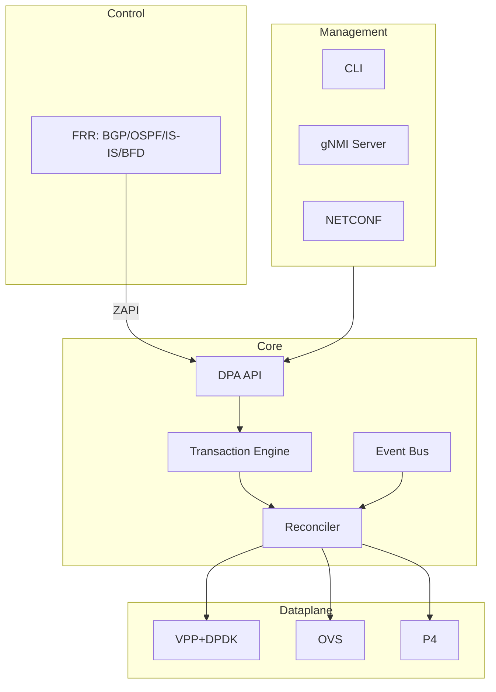
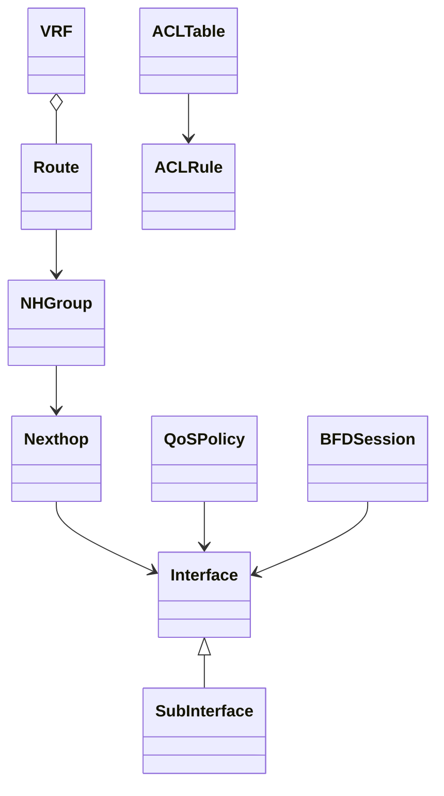
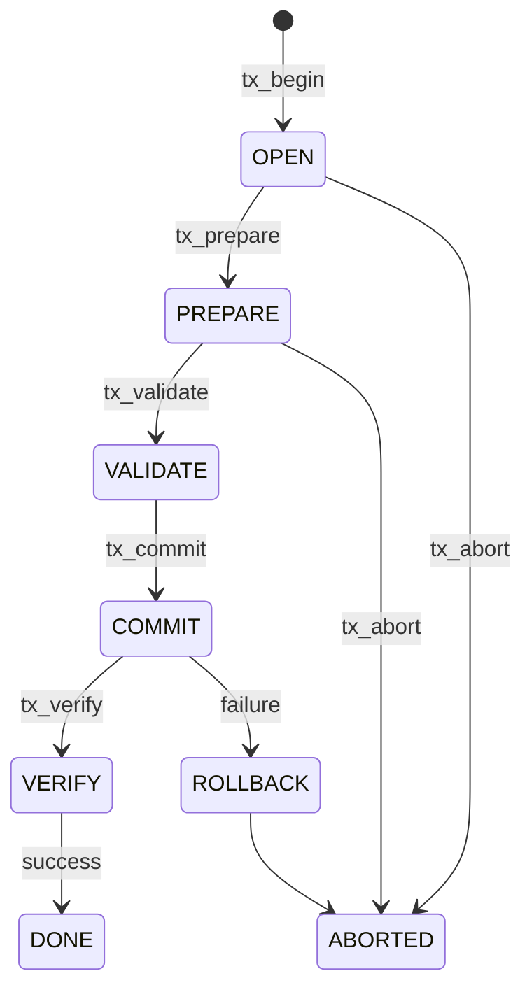
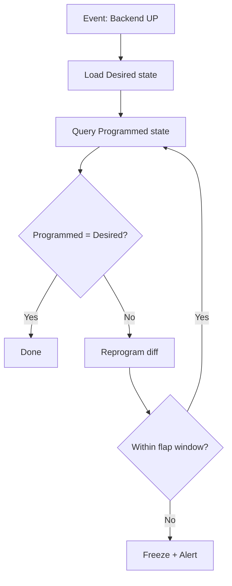
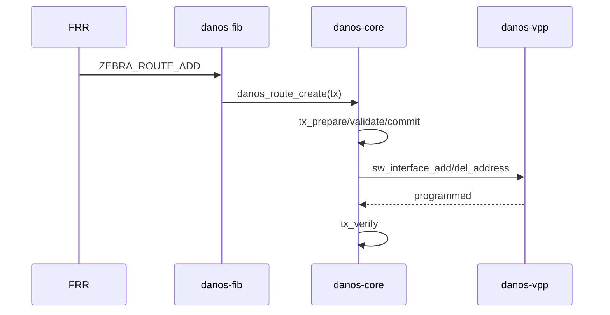

# 第 8 章 文档结构性与形式化改进（v1.1 P2-20）

> v1.1 评审 §8 P2 改进动作（v0.4 前完成）。
> 目录与交叉引用、图表、术语表、可追溯性矩阵。

## 8.1 目录与交叉引用

### 8.1.1 完整章节目录（v1.1 + P2）

```
1.  项目背景与总体目标
2.  DANOS 2018 架构设想
3.  DANOS-Open vs OcNOS Feature Gap 核心结论
4.  重点功能的开源项目借鉴
5.  四条不可违反的原则
6.  总体架构
7.  DPA Object Model（→ 附录 A）
8.  EVPN Object
9.  Capability Model（→ 附录 A danos-capability.yang）
10. Transaction Model（→ §B 事务增强）
11. State & Reconciliation（→ §C Reconciler 增强）
12. FRR → DPA → Dataplane（→ 附录 B ZAPI 映射）
13. Repository Architecture
14. MVP v0.1–v0.4
14A. MVP v0.1 Definition of Done
15. 测试架构
16. OcNOS Compatibility Layer
17. v1.0 架构决策冻结（→ docs/adr/）
18. 下一阶段实施计划
19. 项目最终定位
20. 安全架构（→ v1.1/security/）
21. 高可用 HA 设计（→ v1.1/ha/）
22. 可观测性与 Telemetry（→ v1.1/observability/）
23. 生命周期与升级管理（→ v1.1/p1-enhancements/lifecycle_upgrade.md）
24. 部署与编排（→ v1.1/p2-enhancements/deployment_orchestration.md）  [P2-17]
25. 许可证与社区治理（→ v1.1/p2-enhancements/license_community_governance.md）  [P2-18]
26. 风险评估与缓解（→ v1.1/risk/）

附录：
A.  DPA API Specification v0.1（→ v1.1/dpa-spec/）
B.  FRR ZAPI → DPA 映射表（→ v1.1/p1-enhancements/appendix_b_zapi_mapping.md）
C.  依赖版本兼容矩阵（→ v1.1/p1-enhancements/appendix_c_dependency_matrix.md）
D.  RFC 对齐表（→ v1.1/p1-enhancements/appendix_d_rfc_alignment.md）
E.  DPA vs SAI 对比示例（→ v1.1/p2-enhancements/dpa_vs_sai_comparison.md）  [P2-19]
F.  术语表（本章 §8.4）
G.  可追溯性矩阵（本章 §8.5）
```

### 8.1.2 交叉引用索引

| 引用 | 目标 | 位置 |
|------|------|------|
| "见 §7" | DPA Object Model | 全文 |
| "见 §9" | Capability Model | §4.1, §13 |
| "见 §10" | Transaction Model | §7, §11, §B |
| "见 §11" | State & Reconciliation | §10, §22 |
| "见 §12" | FRR → DPA → Dataplane | §13, 附录 B |
| "见 §17" | 架构决策 | §5, §6 |
| "见 §20" | 安全架构 | §22, §25 |
| "见 §21" | HA 设计 | §14, §23 |
| "见 §22" | 可观测性 | §15, §20 |
| "见 §23" | 生命周期与升级 | §14, §24 |
| "见 §24" | 部署与编排 | §14, §25 |
| "见 §25" | 许可证与社区治理 | §13 |
| "见附录 A" | DPA API Spec | §7, §9 |
| "见附录 B" | ZAPI 映射 | §12 |
| "见附录 C" | 依赖矩阵 | §13, §23 |
| "见附录 D" | RFC 对齐 | §8, §21 |
| "见附录 E" | DPA vs SAI | §5 |

## 8.2 图表清单

### 8.2.1 架构图（Mermaid）

**总体架构**（§6）：


**DPA 对象关系**（§7）：


**事务状态机**（§10）：


**Reconciliation 流程**（§11）：


**FRR→DPA→Backend 时序**（§12）：


## 8.3 形式化规范清单

| 规范 | 格式 | 位置 | 状态 |
|------|------|------|------|
| DPA C ABI | `.h` | `v1.1/dpa-spec/danos_dpa.h` | ✅ v0.1 |
| DPA Protobuf | `.proto` | `v1.1/dpa-spec/danos_dpa.proto` | ✅ v0.1 |
| DPA 语义规范 | `.md` | `v1.1/dpa-spec/danos_dpa_spec.md` | ✅ v0.1 |
| YANG 模型 | `.yang` | `danos-models/yang/` | ✅ 9 模型 |
| Capability Schema | `.yang + .proto` | `v1.1/capability/` | ✅ v0.1 |
| 错误码枚举 | C enum | `danos_dpa.h` | ✅ 21 个 |
| ZAPI 映射表 | `.md` | `v1.1/p1-enhancements/appendix_b_zapi_mapping.md` | ✅ P1 |
| 依赖版本矩阵 | `.md` | `v1.1/p1-enhancements/appendix_c_dependency_matrix.md` | ✅ P1 |
| RFC 对齐表 | `.md` | `v1.1/p1-enhancements/appendix_d_rfc_alignment.md` | ✅ P1 |
| DPA vs SAI 对比 | `.md` | `v1.1/p2-enhancements/dpa_vs_sai_comparison.md` | ✅ P2 |

## 8.4 术语表（附录 F）

| 术语 | 全称 | 定义 | 相关章节 |
|------|------|------|---------|
| DPA | Data Plane Abstraction | DANOS-Open 通用数据面抽象 API，不假设 ASIC | §5, §7 |
| SAI | Switch Abstraction Interface | OCP 交换芯片抽象 API，假设 ASIC | §5, 附录 E |
| DPA Object | - | DPA 管理的网络对象（Interface/Route/ACL/...） | §7 |
| EVI | EVPN Instance | EVPN 虚拟实例，类似 VPLS 实例 | §8 |
| ESI | Ethernet Segment Identifier | EVPN-MH 多归标识符 | §8, §21 |
| IRB | Integrated Routing and Bridging | 集成路由桥接，EVPN L3 网关 | §8 |
| CoPP | Control Plane Policing | 控制面限速，保护 CPU | §20 |
| NH | Next Hop | 下一跳 | §7 |
| NHG | Next Hop Group | 下一跳组（ECMP） | §7 |
| VRF | Virtual Routing and Forwarding | 虚拟路由转发实例 | §7 |
| WAL | Write-Ahead Log | 预写日志，事务持久化 | §10 |
| NSR | Non-Stop Routing | 路由不中断（主备同步） | §21 |
| GR | Graceful Restart | 优雅重启（RFC 4724） | §21, §23 |
| ISSU | In-Service Software Upgrade | 不中断业务升级 | §23 |
| BFD | Bidirectional Forwarding Detection | 双向转发检测 | §7, §21 |
| LACP | Link Aggregation Control Protocol | 链路聚合控制协议 | §14 |
| CNI | Container Network Interface | 容器网络接口 | §24 |
| CLA | Contributor License Agreement | 贡献者许可协议 | §25 |
| DCO | Developer Certificate of Origin | 开发者来源证书 | §25 |
| ADR | Architecture Decision Record | 架构决策记录 | §17, docs/adr/ |
| RFC | Request for Comments | 提案文档（社区流程或 IETF 标准） | §25 |
| TCAM | Ternary Content-Addressable Memory | 三态 CAM，ACL 硬件 | §7 |
| P4 | - | 数据面编程语言 | §5, §6 |
| DPDK | Data Plane Development Kit | 数据面开发套件 | §6 |
| FRR | Free Range Routing | 开源路由协议套件 | §5, §12 |
| VPP | Vector Packet Processor | 矢量包处理器 | §5, §6 |
| OVS | Open vSwitch | 开源虚拟交换机 | §5, §6 |
| gNMI | gRPC Network Management Interface | gRPC 网络管理接口 | §13 |
| NETCONF | Network Configuration Protocol | 网络配置协议 | §13 |

## 8.5 可追溯性矩阵（附录 G）

### 8.5.1 架构决策 → 依据 → 替代方案

| ADR | 决策 | 依据 | 替代方案 | 位置 |
|-----|------|------|---------|------|
| 0001 | DPA ≠ SAI | SAI 假设 ASIC；软件数据面需通用抽象 | SAI（纯 ASIC 场景） | docs/adr/0001 |
| 0002 | VPP 为主数据面 | 矢量化 + DPDK + 生态成熟 | OVS（虚拟化为主）、P4（可编程） | docs/adr/0002 |
| 0003 | FRR 进程隔离 | GPLv2 兼容性 + 协议成熟 | 重写协议（违反原则 2） | docs/adr/0003 |
| 0004 | Apache-2.0 许可证 | 商业友好 + 生态兼容 | GPLv2（传染）、BSD（无专利授权） | docs/adr/0004 |
| 0005 | 事务模型 | 原子性 + 回滚 + 并发控制 | 逐 API 调用（SAI 风格） | docs/adr/0005 |

### 8.5.2 MVP 特性 → 章节 → 测试用例

| MVP 特性 | 章节 | 测试用例 | 状态 |
|---------|------|---------|------|
| DPA C ABI | §7, 附录 A | dpa_errors, dpa_version, dpa_capability | ✅ |
| 事务引擎 | §10 | core, wal | ✅ |
| Reconciler | §11 | core, antiflap | ✅ |
| FRR FIB Adapter | §12, 附录 B | fib_parse, fib_mapper, fib_e2e, fib_e2e_multi | ✅ |
| VPP Backend | §6, §13 | vpp_mapper, vpp_api | ✅ |
| CLI | §13 | cli | ✅ |
| gNMI | §13 | gnmi (11 子测试) | ✅ |
| NETCONF | §13 | netconf | ✅ |
| YANG 模型 | §7, §9 | yang_validator.py (9 模型) | ✅ |
| Conformance | §15 | conformance | ✅ |
| 性能基线 | §15 | perf_baseline, bgp_converge, sw_fwd_baseline | ✅ |
| ACL gNMI | §13 | gnmi.test_gnmi_acl | ✅ v0.2 |
| QoS gNMI | §13 | gnmi.test_gnmi_qos | ✅ v0.2 |
| gNMI Subscribe | §13, §22 | gnmi.test_gnmi_subscribe* | ✅ v0.2 |

### 8.5.3 风险 → 缓解措施 → 责任

| 风险 ID | 风险 | 缓解措施 | 责任模块 | 位置 |
|---------|------|---------|---------|------|
| R-T-01 | 多 backend 语义不一致 | conformance + consistency 测试 | danos-test/conformance | §26 |
| R-P-01 | 软件 dataplane 性能 | 场景限定 + 性能基线 | danos-test/perf | §26 |
| R-T-02 | FRR ZAPI 变更 | 版本锁定 + mock 测试 | danos-fib | §26 |
| R-T-03 | DPDK ABI 破坏 | LTS + 容器隔离 | danos-build | §26 |
| R-E-01 | FRR 社区 | 跟主线 + 内部 fork | - | §26 |
| R-L-01 | GPLv2 传染 | 进程隔离 + 法务确认 | danos-fib | §25, §26 |

## 8.6 MVP 对齐

| 形式化项 | MVP 版本 | 状态 |
|---------|---------|------|
| C ABI 头文件 | v0.1 | ✅ |
| Protobuf IDL | v0.1 | ✅ |
| YANG 模型（9 个） | v0.1 + v0.2 | ✅ |
| 错误码枚举（21 个） | v0.1 | ✅ |
| Capability Schema | v0.1 | ✅ |
| ZAPI 映射表 | v0.2 | ✅ |
| 依赖版本矩阵 | v0.2 | ✅ |
| RFC 对齐表 | v0.2 | ✅ |
| DPA vs SAI 对比 | v0.4 | ✅ P2 |
| 术语表 | v0.4 | ✅ P2 |
| 可追溯性矩阵 | v0.4 | ✅ P2 |
| 架构图（Mermaid） | v0.4 | ✅ P2 |
| 交叉引用索引 | v0.4 | ✅ P2 |
